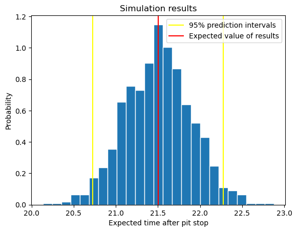
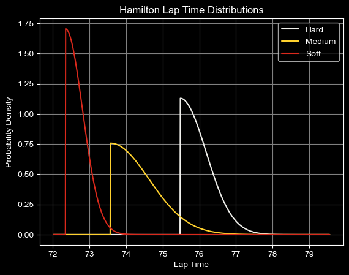
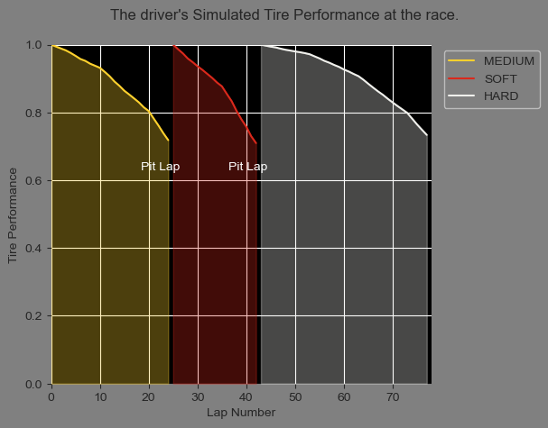

# Pythlete

Pythlete is a package designed to enhance data-based decision-making in sports. While future versions of the package will include other sports as well, the current version is designed to improve decision-making in Formula 1 racing.

This is the package's repository. This is the final code that will be published. Please find the working repository where I am ideating at this link: <https://github.com/AbdullahKhurram30/Pythlete-Working>

You can find the package download instructions on this link: <https://pypi.org/project/pythlete/>

Or just run this in a Python environment

```cmd
pip install pythlete
```

Please see the "uses" folder above for how to use the package. All uses are included in notebook format.

The package consists of four algorithms right now:

## Safety Car Algorithm

This algorithm is used to calculate the time loss due to pitting during the race. The alogrithm uses simulations to predict the time loss and then infer what position one would be in after the pit stop. Some outputs from the algorithm are shown below:

```cmd
On Average:
By Pitting, new position estimated will be:  6 
We lose:  5 positions
Estimated time =  21.5


Lower bound:
Lower bound of 95% prediction interval:  5 
We lose:  4 positions 
New Estimated time =  20.73


Upper bound:
Upper bound of 95% prediction interval:  6 
We lose:  5 positions
New Estimated time =  22.28
```



## Telemetry Algorithm

This algorithm is used to see where during a lap the driver is losing time to his rivals. It uses telemetry data that is publicly available and prints radio messages that can be conveyed to the drivers. Some outputs from the algorithm are shown below:

```output
HAM, we are losing time in ['Between Turns' 'Into Turn 13' 'Into Turn 14']
HAM, we are gaining time in ['Between Turns' 'Into Turn 16' 'Into Turn 9' 'Into Turn 14' 'Into Turn 1' 'Into Turn 10' 'Into Turn 13']
```


## Pit Stop Algorithm

This algorithm helps teams make the decision as to whether or not they can overtake their rival off the track by pitting earlier and getting a tire advantage. This is known as undercutting. Some outputs from the algorithm are shown below:

```output
Recommendation: Consider pitting on laps [65.0] for a strategic advantage.
```


## Tire Strategy Algorithm

This algorithm helps teams decide what tire strategy to use during the race. Probability distributions are used to predict lap times on each compound that are trained based on practice data. The lap times and tire performance are then used to predict the best tire strategy. Some outputs from the algorithm are shown below:



```output
{'MEDIUM': 27, 'SOFT': 18, 'HARD': 33}
```

The algorithm then outputs the simulated lap times and the simulated tire performance as shown below:



